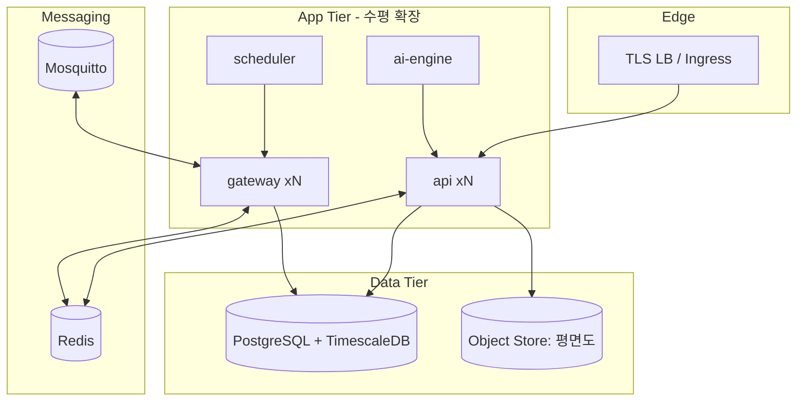
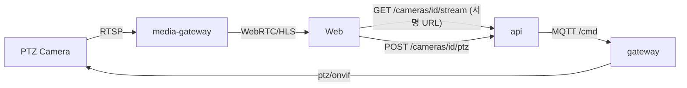
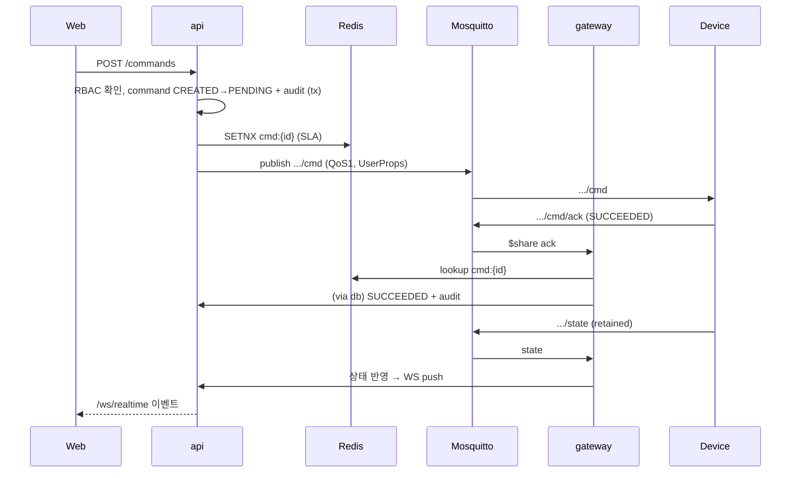

# 시스템 아키텍처 설계서 (HLD/LLD) — SmartHome IoT 관제 시스템

- 근거: [iot_smarthome_srs.md](../iot_smarthome_srs.md), [PROJECT_RULES.md](../PROJECT_RULES.md), [erd.md](erd.md), [mqtt-topic-design.md](mqtt-topic-design.md), [api-spec.md](api-spec.md)
- 상태: 초안 v0.1 (2026-07-09)

---

# Part 1. HLD (High-Level Design)

## 1. 아키텍처 개요

이벤트 기반(Event-driven) 마이크로서비스. **MQTT(Mosquitto)를 실시간 축**, **REST/WS를 관제·제어
축**으로 분리한다. 브로커-facing 수집/제어 경로(`gateway`)와 사용자-facing 경로(`api`)를 분리해
각각 독립 확장한다(SRS 6: 10만 기기 · 500 사용자 · 99.9%).

## 2. 컨텍스트

```mermaid
flowchart LR
  dev[IoT Devices / Sensors / Gateways] -- MQTT5/TLS --> brk[(Mosquitto)]
  web[Web/Mobile Dashboard] -- HTTPS/WSS --> api[API/WS]
  brk <--> gw[Gateway Service]
  gw --> db[(PostgreSQL + TimescaleDB)]
  api --> db
  gw <--> rds[(Redis)]
  api <--> rds
  ai[AI Recommendation Engine] --> api
  api -- 제어 요청 --> gw
  ext[BMS/EMS/Voice/Vision (SRS 7)] -. Open API .-> api
```

## 3. 컴포넌트 매핑 (SRS 1.2 → 구현)

| SRS 구성요소 | 구현 위치 | 비고 |
|---|---|---|
| MQTT Broker | **Mosquitto**(전용) | 인증/ACL 플러그인 연동(§9) |
| IoT Device Gateway | `apps/gateway` | 텔레메트리 수집·명령 발행·ack·LWT/Offline·알람 인테이크 |
| UNS Topic Manager | `packages/mqtt`(`buildTopic`) + gateway | 토픽 생성/검증 단일 소스 |
| Device Management | `apps/api` (device 모듈) + `packages/db` | ERD B |
| Floor Map Management | `apps/api` (spatial 모듈) | ERD A |
| Scheduler Service | `apps/scheduler`(워커) | cron/이벤트 → 명령 발행 |
| Alarm Service | gateway 인테이크 + `apps/api`(정책) + 알림 워커 | ERD E |
| AI Recommendation Engine | `apps/ai-engine` | MLOps 분리(SRS 7) |
| Audit & Logging | `packages/db`(audit_log) + telemetry 수집 | ERD D·H |
| Media/Streaming (옵션) | `apps/media-gateway` | PTZ 카메라 영상(RTSP→WebRTC/HLS), 스트림 URL 서명 |
| Web/Mobile Dashboard | `apps/web`(React) | Mobile은 추후(SRS 7) |

## 4. 배포/컨테이너 뷰



- `api`·`gateway`는 stateless → 수평 확장. 공유 상태는 Redis, 영속은 PostgreSQL.
- `gateway`는 MQTT5 **공유 구독(`$share/`)**으로 인스턴스 간 부하 분산(§8·LLD).

## 5. 주요 데이터 흐름 (HLD 레벨)

1. **텔레메트리 수집**: Device→`/telemetry`(QoS0)→gateway(공유구독)→배치 insert→TimescaleDB→(집계) 대시보드.
2. **제어**: API `POST /commands`→command(CREATED/PENDING)+audit→MQTT `/cmd`(QoS1)→Device→`/cmd/ack`→상태 전이+audit→`/state`(retained).
3. **알람**: Device `/alarm`(QoS2) 또는 LWT/임계치→gateway→`alarm_log`→라우팅/에스컬레이션→알림 채널·대시보드.
4. **AI/HITL**: ai-engine 추천→`ai_recommendation`→(고위험/저신뢰) HITL 승인→승인 시 제어 흐름(2) 재사용, actorType=AI, 결정은 학습 데이터 저장.

## 5-cam. PTZ 카메라 / 영상 (옵션 기능)

- **제어 경로(PTZ)**: 카메라는 `category=CAMERA` device. PTZ 제어는 일반 제어와 동일하게
  api→MQTT `/cmd`(`ptz_move`/`ptz_goto_preset`) 흐름을 재사용 → 수명주기·audit 일관.
  ONVIF 전용 카메라는 gateway 내 **카메라 어댑터**가 MQTT 명령을 ONVIF 호출로 변환.
- **영상 경로(스트림)**: **MQTT/브로커를 경유하지 않는다.** 카메라 RTSP를 `apps/media-gateway`가
  수신해 브라우저용 **WebRTC/HLS**로 중계. 대시보드는 API에서 **단기 서명 URL**을 받아 재생.
  → 고대역폭 영상이 브로커·제어 경로 성능(SRS 6)에 영향 주지 않도록 격리.
- **알람 연동**: 알람 발생 시 `alarm_policy.linked_camera_id`가 있으면 자동 프리셋 이동 명령을
  발행하고, 대시보드 알람 항목에서 즉시 라이브 뷰를 연다(§sequence, §ui-ux).



## 6. 비기능 대응 (SRS 6)

| 목표 | 설계 대응 |
|---|---|
| 명령 지연 ≤ 300ms | 동기 블로킹 배제, QoS1 직접 발행, ack 비동기 상관 |
| 센서 반영 ≤ 1s | QoS0 스트림 + 배치 insert(짧은 flush 주기) |
| 알람 전파 ≤ 3s | QoS2 우선 처리 경로, 비동기 라우팅 |
| 10만 기기 | gateway 수평 확장 + 공유 구독 + Redis 상관 |
| 500 사용자 | api 수평 확장, retained state로 초기 로드 경감 |
| 99.9% | stateless app 다중화, DB HA, 브로커 재연결/세션 복원 |
| Audit 5년 / Telemetry 1y+집계 | 파티셔닝·retention·continuous aggregate |

---

# Part 2. LLD (Low-Level Design)

## 7. 모노레포 구조 (pnpm + Turborepo)

```
apps/
  api/         NestJS: REST + WebSocket (dashboard-facing)
  gateway/     NestJS: MQTT ingest/command/ack/LWT/alarm
  scheduler/   워커: cron/event → 명령 발행
  ai-engine/   추천 생성 (모델 서빙 연동)
  web/         React + Konva 대시보드
packages/
  contracts/   타입·enum·payload 스키마·buildTopic (단일 소스, §PROJECT_RULES 1)
  mqtt/        mqtt.js 래퍼, User Properties 헬퍼, 공유구독 유틸
  db/          pg Pool, repository, node-pg-migrate 마이그레이션
  auth/        JWT 발급/검증, RBAC 가드
```

- 계층 의존: `apps/* → packages/*`, `packages/* ↛ apps/*`. contracts는 최하위(무의존).
- 도메인 enum·토픽·payload는 **contracts에서만** 정의(§PROJECT_RULES 11).

## 8. Gateway 내부 설계 (핵심)

### 8.1 구독 (공유 구독으로 부하 분산)
```
$share/gw/enterprise/+/+/+/+/+/telemetry   (QoS0)
$share/gw/enterprise/+/+/+/+/+/cmd/ack      (QoS1)
$share/gw/enterprise/+/+/+/+/+/state        (QoS1, LWT/OFFLINE 감지)
$share/gw/enterprise/+/+/+/+/+/alarm        (QoS2)
```
- `$share/gw/...`로 여러 gateway 인스턴스가 메시지를 분담 → 단일 지점 병목 제거.

### 8.2 명령 발행 & ack 상관 (인스턴스 무관)
- 발행 인스턴스와 ack 수신 인스턴스가 다를 수 있음 → 상관 상태를 **Redis에 보관**.
- 절차:
  1. `POST /commands`(api) → command row(CREATED→PENDING)+audit → Redis에 `cmd:{commandId}`(상태·SLA 마감시각) 기록 → MQTT `/cmd` 발행(User Properties).
  2. 임의 gateway가 `/cmd/ack` 수신 → Redis/DB에서 commandId 조회 → IN_PROGRESS→SUCCEEDED/FAILED 전이+audit → Redis 키 정리.
- 멱등성: `commandId` 유니크 + Redis `SETNX`로 중복 발행 차단.

### 8.3 타임아웃 스위퍼
- 주기 워커가 Redis에서 SLA 초과 PENDING/IN_PROGRESS 조회 → `TIMED_OUT` 전이 + `mqtt_reason_code` 기록 + audit.

### 8.4 텔레메트리 인제스트
- 수신 메시지를 메모리 버퍼에 모아 짧은 주기(예 500ms)로 TimescaleDB에 **배치 insert(COPY)** → throughput 확보(≤1s 반영).

### 8.5 LWT/Offline
- `/state`의 `OFFLINE` 수신(정상 LWT 포함) → device.current_status 갱신 + `alarm_log`(Proactive/Reactive) 생성.

## 9. 보안 설계 (LLD, §PROJECT_RULES 5)

- **전송**: TLS 종단(LB/Ingress). Mosquitto는 8883(mqtts)·WSS만 개방, 1883 차단.
- **브로커 인증/ACL**: Mosquitto 인증 플러그인(HTTP backend)이 `apps/api`의 검증 엔드포인트 호출 →
  JWT 검증 후 claim `topics`로 ACL 적용. 기기는 username/password(기기별 자격).
- **서비스 간**: mTLS 또는 API Key(`packages/auth`).
- **RBAC 가드**: api 라우트 가드가 리소스 소유 Area/Device/Group 권한 확인 후 처리.

## 10. 데이터 접근 (ORM 미사용)

- `packages/db`: `pg.Pool` + **repository 패턴**. 각 repository는 파라미터라이즈드 쿼리만 사용(SQL 인젝션 차단).
- 트랜잭션: 명령 상태 전이+audit_log 기록은 **동일 트랜잭션**으로 원자성 보장(기록 없는 제어 방지).
- 마이그레이션: **node-pg-migrate** 파일. TimescaleDB hypertable·retention·continuous aggregate도 마이그레이션으로 정의.
- 대량 로그(audit_log)·telemetry는 파티셔닝/hypertable로 보존정책 적용.

## 11. 실시간 대시보드 경로

- `apps/api`가 gateway로부터 상태/알람/명령 이벤트를 Redis pub/sub로 받아 **WebSocket(`/ws/realtime`)**으로 클라이언트에 push.
- 대시보드는 고빈도 `/telemetry`를 직접 구독하지 않음 → api가 집계/다운샘플 후 전달(SRS 6 부하 관리).
- Floor Map: React + Konva. `/state` retained 미러로 초기 색상 즉시 렌더(ON=녹색…OFFLINE=검정).

## 12. 관측성 / HA

- 메트릭(Prometheus): 명령 지연, ack 지연, telemetry lag, 알람 전파 시간, 브로커 연결 수.
- 헬스체크·그레이스풀 셧다운(기기 재연결 시 세션 복원, `clean start=false`).
- 로깅/트레이싱: 요청·명령에 `sessionId`/`commandId` 상관.

## 13. 컴포넌트 상호작용 예 — 제어 명령 (시퀀스)



---

## 14. 미해결/후속 (부록 A.2 연계)

- Mosquitto 단일 노드 HA: 브리징/클러스터 대체(EMQX 등) 필요 시점 판단(SRS 6 가용성).
- ai-engine 모델 서빙·MLOps 파이프라인(SRS 7).
- Multi-tenant 격리(RLS)·다중 건물(SRS 7).
- 알림 채널 provider·Open API/gRPC 외부 연동(SRS 7).
- 배포 오케스트레이션(K8s manifest/Helm) 상세.
