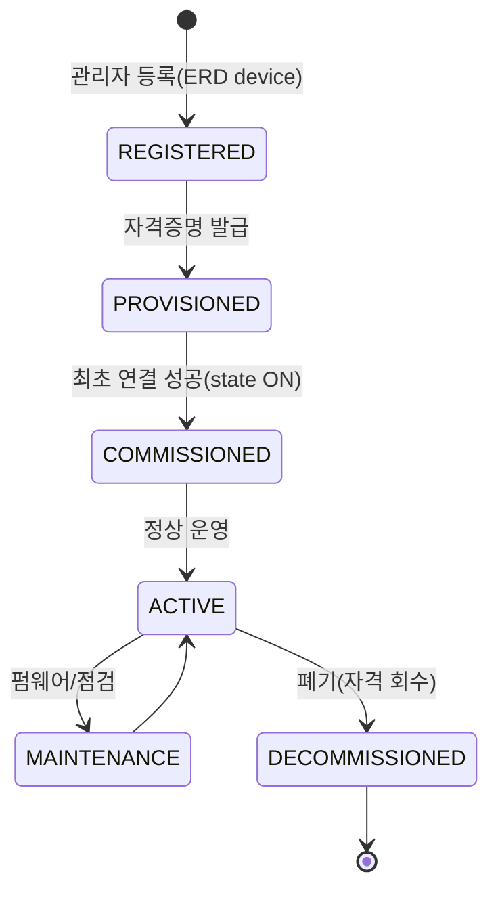
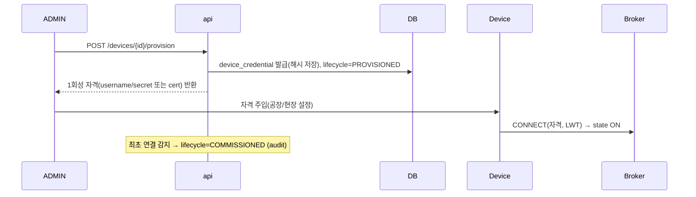
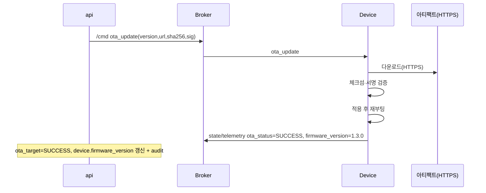

# 기기 수명주기 & 펌웨어 OTA 설계서 — SmartHome IoT

- 근거: SRS 3.1(Firmware Version)·3.3.2(Firmware Update = Proactive 알람)·4.2(보안), [PROJECT_RULES.md](../PROJECT_RULES.md), [erd.md](erd.md), [mqtt-topic-design.md](mqtt-topic-design.md), [architecture.md](architecture.md)
- 상태: 초안 v0.1 (2026-07-09)

---

## 1. 범위

기기의 **등록→자격증명 발급→가동→유지보수→폐기** 전 수명주기와, **펌웨어 OTA(Over-The-Air)
업데이트**를 정의한다. 10만 대 규모(SRS 6)에서 대량 프로비저닝과 안전한 자격/펌웨어 관리를 다룬다.

## 2. 기기 수명주기 상태



- `device.lifecycle_status`(신규 컬럼)로 관리. 상태 전이는 `audit_log` 기록.
- `DECOMMISSIONED`는 물리 삭제가 아니라 **자격 회수 + 논리 폐기**(감사·이력 보존).

## 3. 프로비저닝 (자격증명 수명주기)

### 3.1 원칙
- 기기별 **고유 자격증명**(MQTT username/password 또는 클라이언트 인증서). 공유 자격 금지.
- 자격은 **발급 시 1회 노출**, 저장은 해시/보안 저장소. 회수·회전 가능.
- ACL은 자격에 묶인 **device 서브트리로 제한**(§mqtt-topic-design 6.3).

### 3.2 흐름


### 3.3 대량 프로비저닝 (10만 대)
- `POST /devices/bulk` + `POST /provision/bulk`로 일괄 등록·발급.
- 부트스트랩(선택): 임시 등록 토큰으로 기기가 **자기 등록(claim)** 후 정식 자격 수령.
- 제약 기기: gateway가 대리 연결(자격은 gateway가 보관).

### 3.4 회전/회수
- 회전: 새 자격 발급 → 기기 반영 → 구 자격 만료.
- 회수: `DELETE /devices/{id}/credentials` → 브로커 ACL 즉시 무효화(연결 강제 종료).

## 4. 펌웨어 OTA

### 4.1 구성요소
- **펌웨어 레지스트리**(`firmware_artifact`): 버전·아티팩트 URL·체크섬·**서명**·대상 device_type.
- **롤아웃 잡**(`ota_job`) + **타겟**(`ota_target`): 대상 기기/그룹, 단계적 배포, 상태 추적.
- 아티팩트 다운로드는 **HTTPS(대역 외)**, MQTT는 **제어/상태만** 운반(대용량 금지).

### 4.2 OTA 명령 & 상태 (명령 파이프라인 재사용)
- OTA 지시는 `/cmd`(QoS1) `command=ota_update`:
  ```json
  { "sessionId":"S1", "commandId":"CMD-...-OTA1", "command":"ota_update",
    "target":"light-01", "timestamp":..., 
    "args":{ "version":"1.3.0", "url":"https://.../fw-1.3.0.bin",
             "sha256":"...", "sig":"..." } }
  ```
- 기기 진행 보고는 텔레메트리/상태 채널로 `ota_status`:
  `PENDING → DOWNLOADING → VERIFYING → APPLYING → SUCCESS | FAILED | ROLLED_BACK`.
- 각 전이는 `ota_target.status` 갱신 + `audit_log`. 완료 시 `device.firmware_version` 갱신.



### 4.3 안전장치
- **서명 검증 필수**: 미서명/검증 실패 펌웨어 적용 거부.
- **단계적/카나리 롤아웃**: 소수 → 확대. 실패율 임계 초과 시 자동 중단.
- **롤백**: 적용 실패 시 이전 버전 복구(A/B 파티션 권장), `ROLLED_BACK` 기록.
- **오프라인 기기**: 재연결 시 대기 중 OTA 잡 재개(잡 상태 유지).
- **동시성**: OTA 중 기기는 MAINTENANCE → 일반 제어 큐잉/보류(명령 우선순위 정책, §후속).

### 4.4 Proactive 알람 연동 (SRS 3.3.2)
- 신규 펌웨어 존재/구버전 기기는 **Firmware Update = Proactive 알람**으로 안내(`alarm-rule` 스킬).
- 알람에서 바로 OTA 롤아웃 잡 생성으로 연결.

## 5. ERD 반영 (요약 — 상세는 erd.md 그룹 I)

- `device.lifecycle_status`(신규), `device_credential`, `firmware_artifact`, `ota_job`, `ota_target`.
- Enum: `DeviceLifecycle`, `OtaStatus`, `CredentialType`.

## 6. API (요약 — 상세는 api-spec.md)

- 프로비저닝: `POST /devices/{id}/provision`, `/provision/bulk`, `DELETE /devices/{id}/credentials`
- 펌웨어: `GET/POST /firmware`(레지스트리), `POST /ota/jobs`(롤아웃), `GET /ota/jobs/{id}`
- 수명주기: `PATCH /devices/{id}/lifecycle`

## 7. 보안 고려

- 자격/서명키는 **시크릿 저장소**(후속 보안 심화 문서). 평문 보관 금지.
- 펌웨어 서명키 분리·회전, 아티팩트 무결성(체크섬+서명).
- 프로비저닝/OTA/회수는 **ADMIN 전용** + 전부 감사.

## 8. 미해결/후속

- 시크릿 관리·인증서 PKI 구성(보안 심화 문서)
- A/B 파티션 등 기기측 롤백 메커니즘(하드웨어 의존)
- 명령 우선순위/큐잉 정책(OTA vs 사용자 vs 알람 자동제어) — 운영/복원력 문서로 확장
- 대량 롤아웃 스케줄링·대역폭 관리
