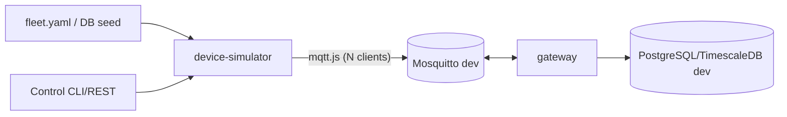
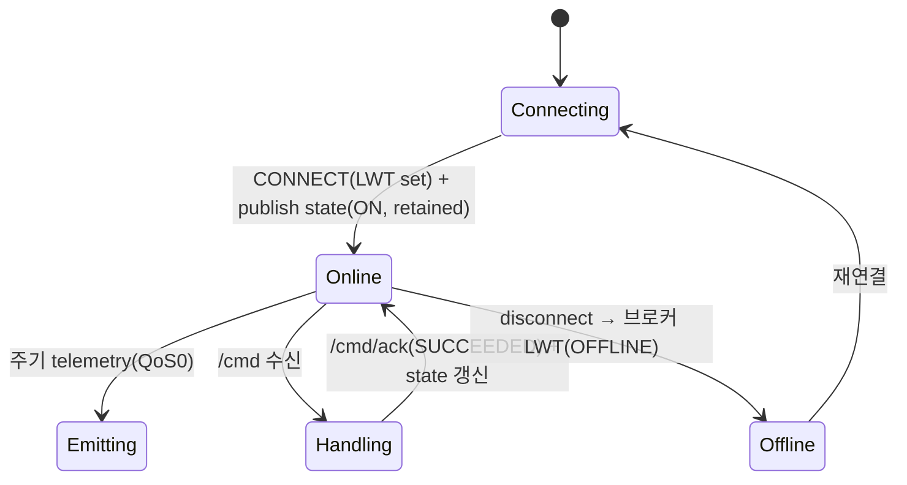

# 가상 기기 시뮬레이터 설계·계획서 — SmartHome IoT

- 목적: **실기기 없이** 개발/테스트를 진행하기 위해 가상 IoT 기기를 생성·배치·구동한다.
- 근거: [PROJECT_RULES.md](../PROJECT_RULES.md) §2~§4, [mqtt-topic-design.md](mqtt-topic-design.md), [erd.md](erd.md), [architecture.md](architecture.md)
- 상태: 초안 v0.1 (2026-07-09)  ·  분류: **개발 지원 도구**(운영 배포 대상 아님)

---

## 1. 배경 & 목표

실제 센서/기기에서 데이터를 받을 수 없으므로, 브로커에 붙어 **실기기처럼 행동하는** 가상 기기를
띄운다. 이를 통해 gateway·알람·AI·대시보드 전 경로를 하드웨어 없이 검증한다.

목표:
- 텔레메트리 스트림, 상태(state), 명령 응답(ack), LWT/Offline, 알람, PTZ를 실기기와 동일 규약으로 재현
- 도면 위 임의 배치(Area·좌표) 및 대량(부하) 배치
- 결함/시나리오 주입으로 예외 경로(FAILED·TIMED_OUT·Offline·임계 초과) 테스트

## 2. 설계 원칙 (필수)

> **시뮬레이터는 gateway 입장에서 실기기와 구분 불가능해야 한다.**

- **`packages/contracts` 재사용**: `buildTopic()`, payload 스키마, enum을 시뮬레이터가 그대로 import.
  독자적 토픽/페이로드 문자열 정의 금지(규칙 드리프트 방지, §PROJECT_RULES 1).
- **규칙 준수**: QoS(0/1/2), LWT 필수, `/state`만 retained, MQTT5 User Properties, 명령 멱등성.
- **프로덕션 격리**: 전용 브로커/DB(dev)만 대상. prod 자격증명·토픽으로 실행 차단(§14).

## 3. 아키텍처 & 위치

```
apps/device-simulator/     # Node.js + TS (모노레포 앱)
  src/
    fleet/        # fleet 정의 로드·검증
    device/       # 가상 기기 런타임(연결·상태머신)
    profiles/     # 텔레메트리 생성 프로파일
    scenarios/    # 스크립트 시나리오(외출/가스누출 등)
    control/      # 제어 API/CLI (spawn/kill/inject)
```



- 각 가상 기기는 경량 MQTT 클라이언트(단일 프로세스 내 다중 연결). 대량 모드는 §12.
- gateway/알람/AI/대시보드는 **수정 없이** 그대로 사용.

## 4. 가상 기기 정의(Fleet) & 배치

기기 목록·배치·행동을 선언적 **fleet 정의**로 관리한다(코드와 분리).

```yaml
# fleet.dev.yaml
site: site1
building: bldg-a
defaults: { telemetryIntervalMs: 1000 }
devices:
  - code: light-01
    category: DEVICE
    deviceType: light
    area: living-room
    pos: { x: 260, y: 190 }
    commands: [turn_on, turn_off]
    telemetry:
      - { metric: power_w, profile: step, on: 12, off: 0 }
  - code: thermostat-01
    category: SENSOR
    area: living-room
    telemetry:
      - { metric: temperature, profile: sine, base: 22, amp: 2, periodS: 600 }
      - { metric: humidity, profile: random-walk, base: 45, step: 1, min: 30, max: 60 }
  - code: gas-valve-01
    category: DEVICE
    deviceType: gas_valve
    area: garage
    faults: { onCommand: { command: close, result: FAILED, reasonCode: 135 } }
  - code: cam-01
    category: CAMERA
    area: living-room
    heading: 90
    ptz: true
    stream: { kind: test-pattern }   # §9
```

- **배치(placement)**: `area` + `pos(x,y)` → 도면 마커 위치. Area/좌표는 ERD·UI와 동일 좌표계.
- **시드 동기화**: fleet 정의로 DB `device`/`camera` 행을 seed 하고(§13), 동일 정의로 시뮬레이터 구동
  → DB 등록 기기와 실제 발행 토픽이 항상 일치.

## 5. 가상 기기 동작 모델 (상태 머신)



- 연결 시 **LWT 필수**(`.../state` OFFLINE retained), 정상 시 `state` ON retained 발행.
- 명령 수신 → 처리 지연 시뮬레이션 → `/cmd/ack` 발행 → `/state` 갱신. **멱등성**: 동일 commandId 무시.

## 6. 텔레메트리 프로파일

| profile | 설명 | 파라미터 |
|---|---|---|
| `const` | 고정값 | value |
| `step` | 상태 연동 계단 | on/off |
| `sine` | 주기 파형(온도 등) | base, amp, periodS |
| `random-walk` | 유계 랜덤워크 | base, step, min, max |
| `spike` | 간헐 급등(임계 테스트) | base, spikeTo, everyS |
| `replay` | CSV 재생 | file |

- 지표는 한 메시지에 묶어 `/telemetry`(QoS0)로 발행 → gateway 배치 insert(§architecture).

## 7. 명령 처리 & 결함 주입

- 정상: `SUCCEEDED` ack + 상태 반영.
- **결함 주입**으로 예외 경로 테스트:
  - `FAILED` + `reasonCode`(위 fleet `faults`)
  - `TIMED_OUT`: ack 미발행 → gateway 스위퍼가 타임아웃 처리 검증
  - `Offline`: 강제 disconnect → LWT/Offline 감지·알람 검증
  - 지연 주입: ack 지연으로 300ms SLA 경계 테스트

## 8. 알람 시나리오 주입

- 수동/스크립트로 `/alarm`(QoS2) 발행 또는 텔레메트리 임계 초과 유발 → 알람 파이프라인(§sequence 6) 검증.
- 예: `gas-valve-01`에서 `CRITICAL 가스누출` 발행 → 라우팅·에스컬레이션·카메라 연동(§9) 확인.

## 9. 카메라 시뮬레이션 (옵션)

- **PTZ 제어**: `/cmd`의 `ptz_move`/`ptz_goto_preset`/`ptz_stop` 수신 → ack 발행(실기기와 동일 경로).
  내부적으로 가상 pan/tilt/zoom 상태만 갱신.
- **영상 스트림**: MQTT 아님. media-gateway에 **합성 소스** 제공:
  - `test-pattern`(컬러바/타임코드) 또는 `loop-file`(샘플 mp4→RTSP) 를 로컬 RTSP로 노출
  - media-gateway가 이를 WebRTC/HLS로 중계 → 대시보드 라이브 뷰(§ui-ux 4.5-cam) 검증
- 도구 후보(부록 A.2에서 확정): `mediamtx`(RTSP 서버) + ffmpeg 테스트 패턴 등.

## 10. 시뮬레이터 제어 (런타임)

경량 Control API/CLI로 실행 중 조작:
```
sim up --fleet fleet.dev.yaml          # 전체 기동
sim spawn --code light-99 --area kitchen
sim kill  --code light-01              # Offline/LWT 유발
sim inject alarm --code gas-valve-01 --severity CRITICAL
sim inject fault --code door-lock-1 --result TIMED_OUT
sim set-profile --code thermostat-01 --metric temperature --spikeTo 40
```
- REST(`/sim/*`)로도 노출해 CI/E2E에서 프로그램 제어.

## 11. 시나리오 스크립트 (AI/HITL 검증)

선언적 타임라인으로 상황을 재현:
```yaml
# scenario: away-detected
- at: 0s   ; set: { presence: false }        # 무재실
- at: 5s   ; event: door_lock                 # 도어 잠금
- expect: ai_recommendation(type=AWAY)        # → HITL 승인 흐름(§sequence 8)
```
- 외출/취침(AI 판단), 가스누출(알람+카메라), 배터리 저하(Proactive) 등 골든 시나리오 세트 유지.

## 12. 부하 테스트 모드 (SRS 6)

- 목표: 동시 기기 **10만**, 텔레메트리 처리·명령 300ms·알람 3s 검증.
- 접근:
  - 경량 클라이언트(상태 최소화), 프로세스당 수천 연결, 다중 프로세스/노드로 스케일아웃
  - 텔레메트리 발행률·기기 수를 파라미터화(`--devices 100000 --rate 0.2hz`)
  - 관측: gateway 지연·telemetry lag·브로커 연결 수 메트릭(§architecture 12)와 연계
- 별도 `sim load` 모드로 실행(개별 기기 로직 최소화).

## 13. 시드 데이터 동기화

- **단일 소스**: fleet 정의 → (a) DB seed 마이그레이션/스크립트로 `device`/`camera`/`area` 행 생성,
  (b) 동일 정의로 시뮬레이터 구동. 두 경로가 같은 `code`·토픽을 쓰므로 불일치 없음.
- 좌표/Area는 평면도 seed와 정합(도면 마커 즉시 표시).

## 14. 안전장치 (프로덕션 격리)

- 대상 브로커/DB URL이 dev 화이트리스트가 아니면 **기동 거부**.
- 시뮬레이터 clientId 접두어 `sim:` 고정 → 브로커 ACL/모니터링에서 식별·차단 가능.
- prod 프로파일에서 `apps/device-simulator` 빌드/배포 제외.

## 15. 구현 단계 (마일스톤)

1. **M1 기본 기기**: contracts 재사용, connect+LWT+state+telemetry(sine/step) 1~10대.
2. **M2 명령·결함**: `/cmd`→ack 수명주기, FAILED/TIMED_OUT/Offline 주입.
3. **M3 배치·시드**: fleet.yaml + DB seed 동기화, 도면 배치.
4. **M4 알람·시나리오**: 알람 주입 + 외출/가스누출 스크립트.
5. **M5 카메라**: PTZ ack + 합성 스트림(media-gateway 연동).
6. **M6 부하 모드**: 대량 기기·부하 측정.

## 16. 미해결/후속 (부록 A.2 연계)

- 합성 영상 스택 확정(mediamtx/ffmpeg vs 대안)
- 부하 모드 목표 규모별 인프라(단일 노드 한계·다중 노드)
- fleet 정의를 관리 UI에서 편집·배치할지(옵션)
- 시나리오 결과 자동 검증(assertion) 프레임워크
