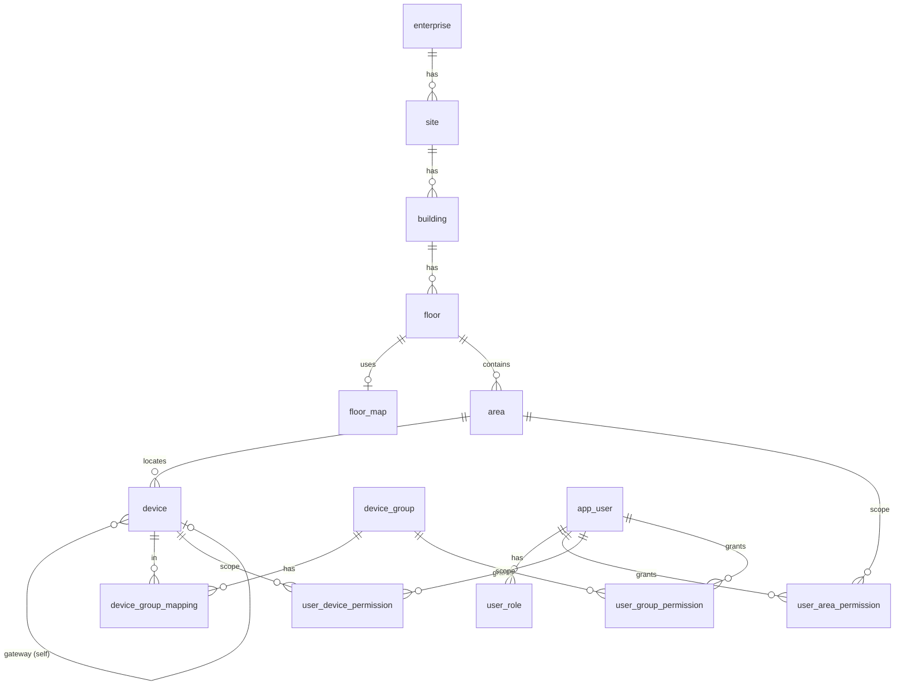
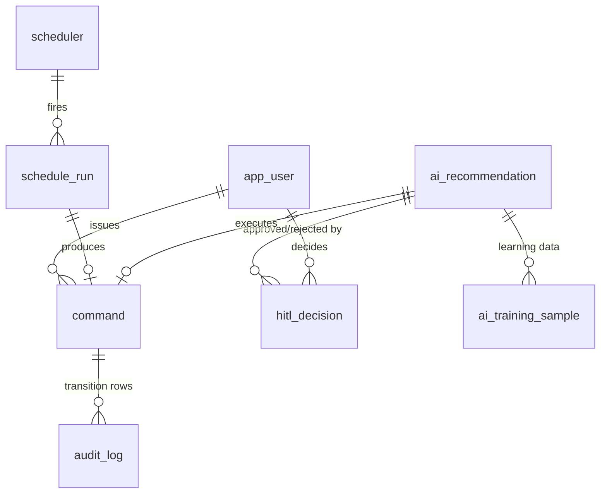
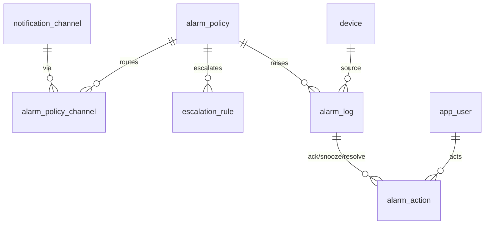

# ERD — SmartHome IoT 관제 시스템 데이터베이스 설계

- 대상 DB: **PostgreSQL** (+ **TimescaleDB** 텔레메트리)
- 근거: [iot_smarthome_srs.md](../iot_smarthome_srs.md), 규칙 [PROJECT_RULES.md](../PROJECT_RULES.md)
- 상태: 초안 v0.1 (2026-07-09)

## 0. 설계 규약

- 테이블·컬럼명은 **snake_case**. PostgreSQL 예약어 회피 위해 사용자 테이블은 `app_user`.
- 엔티티 PK는 `uuid`(기본값 `gen_random_uuid()`), 감사/시계열 등 대량 로그는 `bigint identity`.
- 모든 시각 컬럼은 `timestamptz`. 텔레메트리 시각만 `timestamptz`(hypertable 파티션 키).
- 상태·종류 값(enum)은 **`packages/contracts` 단일 소스**와 일치(§PROJECT_RULES 1·11).
  DB에서는 PostgreSQL `ENUM` 또는 `text + CHECK`로 구현(마이그레이션은 node-pg-migrate).
- 스키마 변경은 **node-pg-migrate 마이그레이션 파일로만**. 수동 DDL 금지.
- UNS 계층(`enterprise/site/building/floor/area/device`)을 테이블 계층으로 그대로 반영.
- `Audit_Log` 컬럼은 SRS 4.3.2에서 **고정**이므로 이름/의미를 임의 변경하지 않는다.

## 1. 도메인 그룹

| # | 그룹 | 핵심 테이블 |
|---|---|---|
| A | 공간 (Spatial) | `enterprise, site, building, floor, floor_map, area, image` |
| B | 기기·그룹 (Device) | `device, device_group, device_group_mapping` |
| B-cam | PTZ 카메라 (옵션) | `camera, camera_preset, camera_coverage` |
| C | 사용자·권한 (RBAC) | `app_user, user_role, user_area_permission, user_device_permission, user_group_permission` |
| D | 명령·감사 (Command/Audit) | `command, audit_log` |
| E | 알람 (Alarm) | `alarm_policy, notification_channel, alarm_policy_channel, escalation_rule, alarm_log, alarm_action` |
| F | 스케줄러 (Scheduler) | `scheduler, schedule_run` |
| G | AI·HITL | `ai_recommendation, hitl_decision, ai_training_sample` |
| H | 텔레메트리 (TimescaleDB) | `telemetry` (hypertable) |
| I | 프로비저닝·OTA | `device_credential, firmware_artifact, ota_job, ota_target` |
| J | 조명/부하 제어 (Lighting) | `holiday, time_program, time_program_slot, time_program_group, system_setting` (→ [addendum](srs-lighting-control-addendum.md)) |

---

## 2. ER 다이어그램

### 2.1 공간 · 기기 · 권한

### 2.2 명령 · 감사 · 스케줄러 · AI/HITL

### 2.3 알람

---

## 3. 테이블 상세

### A. 공간 (Spatial)

**enterprise** — UNS 최상위(멀티테넌트 대비, SRS 7)
| 컬럼 | 타입 | 키 | 설명 |
|---|---|---|---|
| id | uuid | PK | |
| slug | text | UQ | UNS 세그먼트(kebab-case) |
| name | text | | 표시명 |
| created_at | timestamptz | | |

**site**
| id | uuid | PK | |
| enterprise_id | uuid | FK→enterprise | |
| slug | text | | UNS 세그먼트, (enterprise_id, slug) UNIQUE |
| name | text | | |

**building**
| id | uuid | PK | |
| site_id | uuid | FK→site | |
| slug / name | text | | (site_id, slug) UNIQUE |

**floor**
| id | uuid | PK | |
| building_id | uuid | FK→building | |
| slug / name | text | | (building_id, slug) UNIQUE |
| floor_map_id | uuid | FK→floor_map (nullable) | 평면도 |
| pos_x / pos_y | numeric | | 배경 표시 좌표(addendum §2.2, 마이그레이션 0016) |

**floor_map** — 평면도 업로드·스케일(SRS 2.1.1)
| id | uuid | PK | |
| image_url | text | | 저장 경로 |
| width_px / height_px | int | | 원본 픽셀 크기 |
| scale_m_per_px | numeric | | 스케일(미터/픽셀) |
| uploaded_by | uuid | FK→app_user | |
| uploaded_at | timestamptz | | |

**image** — 재사용 이미지 라이브러리(addendum §2.1, 마이그레이션 0016). 레거시 이미지관리.
| id | uuid | PK | |
| name | text | | 이미지 이름 |
| image_url | text | UQ | 저장 경로(로컬 파일시스템) |
| width_px / height_px | int | | 원본 픽셀 크기 |
| uploaded_by | uuid | FK→app_user | |
| uploaded_at | timestamptz | | |

**area** — Polygon 기반 공간(SRS 2.1.1) + 분전반형(addendum §2.3)
| id | uuid | PK | |
| floor_id | uuid | FK→floor | |
| slug / name | text | | UNS 세그먼트, (floor_id, slug) UNIQUE |
| polygon | jsonb | | Polygon 좌표 배열 `[[x,y],...]` |
| kind | enum | | `ROOM / PANEL`(분전반형), 기본 ROOM (마이그레이션 0016) |
| image_id | uuid | FK→image (nullable) | 분전반 배경이미지 |
| pos_x / pos_y | numeric | | 분전반 표시 좌표 |
| created_by | uuid | FK→app_user | |

---

### B. 기기·그룹 (Device)

**device** — SRS 3.1.1 + 위치/Area 매핑(2.1.2)
| 컬럼 | 타입 | 키 | 설명 |
|---|---|---|---|
| id | uuid | PK | 내부 식별자 |
| code | text | UQ | Device ID(사용자 표시용, 예 `device01`) |
| name | text | | Device Name |
| category | enum | | `DEVICE / SENSOR / GATEWAY / CAMERA` |
| device_type | text | | 세부 타입(light, thermostat 등) |
| manufacturer | text | | |
| model | text | | |
| firmware_version | text | | |
| mqtt_topic | text | UQ | `buildTopic()` 결과 canonical 토픽 |
| current_status | enum | | `ON / OFF / WARNING / ALARM / OFFLINE` (Floor Map 색상 매핑) |
| lifecycle_status | enum | | `REGISTERED / PROVISIONED / COMMISSIONED / ACTIVE / MAINTENANCE / DECOMMISSIONED` (§device-lifecycle-ota) |
| area_id | uuid | FK→area | 위치 공간 |
| pos_x / pos_y | numeric | | 도면 좌표 |
| gateway_id | uuid | FK→device (self, nullable) | 소속 게이트웨이(레거시 RMU) |
| connection_protocol | enum | | `TCP_IP / SERIAL / MODBUS_TCP / MODBUS_RTU / ZIGBEE / ZWAVE` (선택, 마이그레이션 0014) |
| connection_config | jsonb | | 연결 파라미터. 레거시 차단기 Address(06~)·Gateway IP/PORT를 여기 저장(addendum §3.1·§3.2) |
| load_class | enum | | `NORMAL / EMERGENCY / RESERVE`(부하 구분, 마이그레이션 0017). RESERVE는 관제 화면 미표시 |
| description | text | | 차단기 설명 |
| created_at / updated_at | timestamptz | | |

> `mqtt_topic`은 하드코딩이 아니라 공간 계층+code로부터 `buildTopic()`으로 생성해 저장(§PROJECT_RULES 2).

**device_group** — SRS 3.1.2
| id | uuid | PK | |
| slug / name | text | | |
| is_dynamic | bool | | Dynamic Group 여부 |
| dynamic_rule | jsonb | | 동적 그룹 조건(예: type=light AND area=…) |
| created_at | timestamptz | | |

**device_group_mapping** — N:M(SRS 3.1.2)
| device_id | uuid | PK, FK→device | |
| group_id | uuid | PK, FK→device_group | |
| (PK = device_id + group_id) | | | |

---

### B-cam. PTZ 카메라 (옵션 기능)

카메라는 `device.category = CAMERA` 로 등록되어 UNS 토픽·위치·Area 매핑을 재사용한다.
카메라 고유 속성(스트림·PTZ·프리셋)은 아래 확장 테이블에 둔다. **영상 스트림은 MQTT가
아니라 별도 미디어 경로(RTSP/WebRTC/HLS)** 로 처리한다(§architecture).

**camera** — device 1:1 확장
| 컬럼 | 타입 | 키 | 설명 |
|---|---|---|---|
| device_id | uuid | PK, FK→device | category=CAMERA인 device |
| protocol | enum | | `RTSP / WEBRTC / HLS / ONVIF` |
| stream_url | text | | 원본 스트림 주소(내부, 미디어 서비스만 접근) |
| onvif_endpoint | text | | PTZ/제어용 ONVIF 주소(nullable) |
| is_ptz | bool | | PTZ 지원 여부 |
| resolution | text | | 예 `1920x1080` |
| fov_deg | numeric | | 화각(도면 방향 표시용, nullable) |
| heading_deg | numeric | | 설치 방향(도면 마커, nullable) |

**camera_preset** — PTZ 프리셋 위치
| id | uuid | PK | |
| camera_id | uuid | FK→camera | |
| name | text | | 예 `현관`, `창가` |
| pan / tilt / zoom | numeric | | PTZ 좌표 |
| created_by | uuid | FK→app_user | |

**camera_coverage** — 카메라가 커버하는 Area(N:M, 알람 현장 확인 연동)
| camera_id | uuid | PK, FK→camera | |
| area_id | uuid | PK, FK→area | |

> **PTZ 제어는 별도 테이블 없이 `command`를 재사용**한다: `command` ∈
> `ptz_move`(args: pan/tilt/zoom 델타), `ptz_goto_preset`(args: presetId), `ptz_stop`,
> target_type=DEVICE(카메라). 수명주기·`audit_log` 기록은 일반 제어와 동일(§D).
> **알람 연동**: `alarm_policy.linked_camera_id`(nullable) + `auto_goto_preset_id`(nullable)로
> 알람 발생 시 지정 카메라를 프리셋으로 이동시킬 수 있다(옵션).

---

### C. 사용자·권한 (RBAC, SRS 2)

**app_user**
| id | uuid | PK | |
| username | text | UQ | |
| email | text | UQ | |
| password_hash | text | | JWT 로그인용(§5) |
| display_name | text | | |
| is_active | bool | | |
| created_at | timestamptz | | |

**user_role**
| user_id | uuid | PK, FK→app_user | |
| role | enum | PK | `ADMIN / USER / MONITOR / HITL_APPROVER` |

**user_area_permission / user_device_permission / user_group_permission** — Area·Device·Group 단위 권한(SRS 2.1.6)
| user_id | uuid | PK, FK→app_user | |
| {area_id\|device_id\|group_id} | uuid | PK, FK | 대상 |
| access_level | enum | | `VIEW / CONTROL / MANAGE` |

---

### D. 명령·감사 (Command/Audit, SRS 3.1.3 + 4.3)

**command** — 제어 명령 집합체(수명주기 현재 상태 보관)
| 컬럼 | 타입 | 키 | 설명 |
|---|---|---|---|
| command_id | text | PK | 전역 유일 `CMD-YYYYMMDD-<seq>`, **멱등성 키** |
| session_id | text | | Session ID |
| actor_type | enum | | `ADMIN / USER / AI / SYSTEM` |
| actor_id | uuid | FK→app_user (nullable) | AI/SYSTEM이면 null |
| role | text | | 발행 시 역할 |
| target_type | enum | | `DEVICE / GROUP` |
| target_id | uuid | | device/group id |
| command | text | | 예 `turn_on` |
| payload | jsonb | | 표준 JSON payload |
| status | enum | | `CREATED / PENDING / IN_PROGRESS / SUCCEEDED / FAILED / TIMED_OUT` |
| mqtt_reason_code | int | | 실패 원인 |
| created_at / updated_at | timestamptz | | |

**audit_log** — SRS 4.3.2 **컬럼 고정** (제어뿐 아니라 로그인·권한변경·스케줄러변경·알람승인도 기록, SRS 4.2.4)
| 컬럼(SRS 명) | 물리 컬럼 | 타입 | 키 | 설명 |
|---|---|---|---|---|
| Log ID | log_id | bigint | PK(identity) | |
| Timestamp | ts | timestamptz | | 발생시간 |
| Actor Type | actor_type | enum | | ADMIN/USER/AI/SYSTEM |
| Actor ID | actor_id | uuid | | 행위자 |
| Target Type | target_type | enum | | Device/Group (비명령 이벤트는 확장값 허용) |
| Target ID | target_id | text | | 대상 |
| Command | command | text | | 실행 명령(비명령 이벤트는 이벤트명) |
| Reason | reason | text | | 발생 사유 |
| Execution Status | execution_status | enum | | CREATED/PENDING/IN_PROGRESS/SUCCEEDED/FAILED/TIMED_OUT |
| MQTT Reason Code | mqtt_reason_code | int | | 실패 원인 |
| Session ID | session_id | text | | |
| Command ID | command_id | text | FK→command (nullable) | |

> **명령 수명주기의 모든 상태 전이는 audit_log에 1행씩 append**(§PROJECT_RULES 4.3). 보존 5년+.

---

### E. 알람 (Alarm, SRS 3.3 + 4.3)

**alarm_policy**
| id | uuid | PK | |
| name | text | | |
| tier | enum | | `REACTIVE / PROACTIVE / OPTIMIZATION` |
| target_type | enum | | `DEVICE / GROUP / AREA` |
| target_id | uuid | | 적용 대상 |
| metric | text | | 임계 대상 지표(temperature, battery 등) |
| operator | enum | | `GT / GTE / LT / LTE / EQ` |
| threshold_value | numeric | | 임계치 |
| duration_sec | int | | 지속시간 조건 |
| severity | enum | | `INFO / WARNING / CRITICAL` |
| enabled | bool | | |
| linked_camera_id | uuid | FK→camera (nullable) | 알람 시 현장 확인용 카메라(옵션) |
| auto_goto_preset_id | uuid | FK→camera_preset (nullable) | 발생 시 자동 이동 프리셋(옵션) |
| created_by | uuid | FK→app_user | |

**notification_channel**
| id | uuid | PK | |
| type | enum | | `PUSH / EMAIL / SMS / WEBHOOK` |
| name | text | | |
| config | jsonb | | 채널 설정(provider는 부록 A.2 미정) |

**alarm_policy_channel** — Routing Rule(N:M)
| policy_id | uuid | PK, FK→alarm_policy | |
| channel_id | uuid | PK, FK→notification_channel | |

**escalation_rule**
| id | uuid | PK | |
| policy_id | uuid | FK→alarm_policy | |
| level | int | | 승급 단계 |
| after_sec | int | | 미대응 대기 시간 |
| notify_channel_id | uuid | FK→notification_channel (nullable) | |
| notify_role | enum | | 승급 대상 역할(nullable) |

**alarm_log** — 알람 이벤트(Audit_Log와 분리, SRS 4.3.1)
| id | bigint | PK(identity) | |
| policy_id | uuid | FK→alarm_policy (nullable) | LWT/Offline 등 정책 외 발생 허용 |
| device_id | uuid | FK→device (nullable) | 발생원 |
| tier | enum | | REACTIVE/PROACTIVE/OPTIMIZATION |
| severity | enum | | |
| message | text | | |
| state | enum | | `RAISED / ACK / SNOOZED / RESOLVED` |
| raised_at | timestamptz | | |
| snoozed_until | timestamptz | | Snooze(SRS 2.2) |
| resolved_at | timestamptz | | |

**alarm_action** — 사용자/모니터 조치 이력(SRS 2.2·2.3)
| id | bigint | PK(identity) | |
| alarm_id | bigint | FK→alarm_log | |
| actor_id | uuid | FK→app_user | |
| action_type | enum | | `ACK / SNOOZE / RESOLVE / NOTE` |
| note | text | | |
| ts | timestamptz | | |

---

### F. 스케줄러 (Scheduler, SRS 3.4)

**scheduler**
| id | uuid | PK | |
| name | text | | |
| target_type | enum | | `DEVICE / GROUP` |
| target_id | uuid | | |
| schedule_type | enum | | `ONE_TIME / DAILY / WEEKLY / MONTHLY / CRON / EVENT` |
| run_at | timestamptz | | ONE_TIME용 |
| cron_expr | text | | CRON용 |
| days_of_week | int[] | | WEEKLY용(0~6) |
| day_of_month | int | | MONTHLY용 |
| event_trigger | jsonb | | EVENT용 조건 |
| payload | jsonb | | 실행할 표준 명령 payload |
| enabled | bool | | |
| created_by | uuid | FK→app_user | |

**schedule_run** — 실행 이력
| id | bigint | PK(identity) | |
| scheduler_id | uuid | FK→scheduler | |
| fired_at | timestamptz | | |
| command_id | text | FK→command (nullable) | 발행된 명령 연결 |
| status | enum | | `FIRED / SKIPPED / FAILED` |

---

### G. AI · HITL (SRS 3.5)

**ai_recommendation**
| id | uuid | PK | |
| type | enum | | `ANOMALY / ENERGY / AWAY / SLEEP / RISK` |
| target_type | enum | | `DEVICE / GROUP / AREA` |
| target_id | uuid | | |
| proposed_command | text | | |
| proposed_payload | jsonb | | |
| confidence_score | numeric | | 0.0~1.0 |
| requires_hitl | bool | | 임계치 미만 또는 고위험 장치면 true(§PROJECT_RULES 9) |
| status | enum | | `PENDING_APPROVAL / APPROVED / REJECTED / EXECUTED / EXPIRED` |
| model_version | text | | |
| command_id | text | FK→command (nullable) | 실행된 명령 |
| created_at | timestamptz | | |

**hitl_decision** — 승인/거절 (학습 데이터로도 사용, SRS 3.5)
| id | uuid | PK | |
| recommendation_id | uuid | FK→ai_recommendation | |
| approver_id | uuid | FK→app_user | |
| decision | enum | | `APPROVE / REJECT` |
| reason | text | | |
| decided_at | timestamptz | | |

**ai_training_sample** — 학습 데이터 적재(결정 + context 스냅샷)
| id | bigint | PK(identity) | |
| recommendation_id | uuid | FK→ai_recommendation | |
| context | jsonb | | 판단 시점 센서/상태 스냅샷 |
| decision | enum | | APPROVE/REJECT (라벨) |
| created_at | timestamptz | | |

---

### I. 프로비저닝 · 펌웨어 OTA (SRS 3.1·3.3.2, §device-lifecycle-ota)

**device_credential** — 기기별 자격증명(1:N, 회전 이력)
| id | uuid | PK | |
| device_id | uuid | FK→device | |
| cred_type | enum | | `MQTT_PASSWORD / CLIENT_CERT` |
| secret_hash | text | | 해시 저장(평문 금지) |
| status | enum | | `ACTIVE / ROTATING / REVOKED` |
| issued_at / expires_at | timestamptz | | |

**firmware_artifact** — 펌웨어 레지스트리
| id | uuid | PK | |
| device_type | text | | 대상 타입 |
| version | text | | 예 `1.3.0` |
| url | text | | 아티팩트(HTTPS, 대역 외) |
| sha256 | text | | 무결성 체크섬 |
| signature | text | | 서명(검증 필수) |
| created_at | timestamptz | | |

**ota_job** — 롤아웃 잡
| id | uuid | PK | |
| firmware_id | uuid | FK→firmware_artifact | |
| target_type | enum | | `DEVICE / GROUP` |
| target_id | uuid | | |
| strategy | enum | | `ALL_AT_ONCE / CANARY / STAGED` |
| status | enum | | `CREATED / RUNNING / PAUSED / COMPLETED / ABORTED` |
| created_by | uuid | FK→app_user | |

**ota_target** — 잡 내 기기별 진행
| id | bigint | PK(identity) | |
| job_id | uuid | FK→ota_job | |
| device_id | uuid | FK→device | |
| status | enum | | `PENDING / DOWNLOADING / VERIFYING / APPLYING / SUCCESS / FAILED / ROLLED_BACK` |
| command_id | text | FK→command (nullable) | ota_update 명령 연결 |
| updated_at | timestamptz | | |

> OTA 지시는 `command`(`command=ota_update`)를 재사용(§D). 대용량 아티팩트는 MQTT가 아닌 HTTPS.

---

### H. 텔레메트리 (TimescaleDB, SRS 4.3.1)

**telemetry** — hypertable (파티션 키 = `time`)
| 컬럼 | 타입 | 설명 |
|---|---|---|
| time | timestamptz | 측정 시각(하이퍼테이블 파티션) |
| device_id | uuid | 발생 기기(인덱스) |
| metric | text | 지표명(temperature, humidity, power 등) |
| value_num | double precision | 수치 값 |
| value_text | text | 비수치 값(nullable) |
| quality | smallint | 품질 플래그(nullable) |

- **보존 정책**: 원본 1년(retention policy), 집계는 continuous aggregate로 5년+ 유지(SRS 6).
- 관계형 무결성보다 write throughput 우선 → `device_id`는 논리 참조(FK 강제는 성능 검토 후 결정, 부록 A.2).

---

### J. 조명/부하 제어 (Lighting, → [addendum](srs-lighting-control-addendum.md))

레거시 차단기 조명제어 도메인. 예약(One-Time)은 기존 `scheduler`(schedule_type=ONE_TIME)를
재사용하고, 장애이력은 `audit_log`+`alarm_log` 조회 뷰로 제공하므로 신규 테이블이 없다.

**holiday** — 휴일 달력(addendum §7, 마이그레이션 0018). 타임프로그램 공휴일 판정에 사용.
| 컬럼 | 타입 | 키 | 설명 |
|---|---|---|---|
| id | uuid | PK | |
| month / day | smallint | | 월(1–12)·일(1–31) |
| lunar_solar | enum | | `SOLAR / LUNAR`(음력은 스케줄 시 양력 변환) |
| name | text | | 휴일명. (month, day, lunar_solar, name) UNIQUE |
| created_at | timestamptz | | |

**time_program** — 정기 운영 스케줄 템플릿(addendum §6.2, 마이그레이션 0019). 최대 300개.
| id | uuid | PK | |
| program_no | smallint | UQ | 1–300 (CHECK) |
| name | text | | |
| enabled | bool | | |
| created_by | uuid | FK→app_user | |
| created_at | timestamptz | | |

**time_program_slot** — 프로그램의 (요일 또는 공휴일) × 시각 × ON/OFF 슬롯.
| id | uuid | PK | |
| time_program_id | uuid | FK→time_program | |
| day_of_week | smallint | | 0=일 ~ 6=토(공휴일 슬롯이면 NULL) |
| is_holiday | bool | | 공휴일 슬롯 여부. day_of_week와 XOR(CHECK) |
| at_time | time | | 운영 시각 |
| power_on | bool | | ON(true)/OFF(false) |

**time_program_group** — 스케줄 등록(프로그램 ↔ Device_Group N:M, addendum §6.3).
| time_program_id | uuid | PK, FK→time_program | |
| group_id | uuid | PK, FK→device_group | |

**system_setting** — 운영 설정 key/value(addendum §1·§4·§5, 마이그레이션 0020). 하드코딩 금지 원칙.
| key | text | PK | 예 `control.sequential_interval_ms`(순차 제어 1.5초), `legacy.server_endpoint` |
| value | jsonb | | 설정값 |
| description | text | | 설명 |
| updated_by | uuid | FK→app_user | |
| updated_at | timestamptz | | |

---

## 4. Enum 목록 (→ `packages/contracts` 단일 소스)

| Enum | 값 |
|---|---|
| DeviceCategory | DEVICE, SENSOR, GATEWAY, CAMERA |
| CameraProtocol | RTSP, WEBRTC, HLS, ONVIF |
| DeviceStatus | ON, OFF, WARNING, ALARM, OFFLINE |
| DeviceLifecycle | REGISTERED, PROVISIONED, COMMISSIONED, ACTIVE, MAINTENANCE, DECOMMISSIONED |
| CredentialType | MQTT_PASSWORD, CLIENT_CERT |
| OtaStatus | PENDING, DOWNLOADING, VERIFYING, APPLYING, SUCCESS, FAILED, ROLLED_BACK |
| ActorType | ADMIN, USER, AI, SYSTEM |
| TargetType | DEVICE, GROUP, AREA |
| ExecutionStatus | CREATED, PENDING, IN_PROGRESS, SUCCEEDED, FAILED, TIMED_OUT |
| Role | ADMIN, USER, MONITOR, HITL_APPROVER |
| AccessLevel | VIEW, CONTROL, MANAGE |
| AlarmTier | REACTIVE, PROACTIVE, OPTIMIZATION |
| Severity | INFO, WARNING, CRITICAL |
| AlarmState | RAISED, ACK, SNOOZED, RESOLVED |
| AlarmActionType | ACK, SNOOZE, RESOLVE, NOTE |
| ChannelType | PUSH, EMAIL, SMS, WEBHOOK |
| ScheduleType | ONE_TIME, DAILY, WEEKLY, MONTHLY, CRON, EVENT |
| ScheduleRunStatus | FIRED, SKIPPED, FAILED |
| RecommendationType | ANOMALY, ENERGY, AWAY, SLEEP, RISK |
| RecommendationStatus | PENDING_APPROVAL, APPROVED, REJECTED, EXECUTED, EXPIRED |
| HitlDecision | APPROVE, REJECT |
| DeviceConnectionProtocol | TCP_IP, SERIAL, MODBUS_TCP, MODBUS_RTU, ZIGBEE, ZWAVE |
| LoadClass | NORMAL, EMERGENCY, RESERVE |
| LunarSolar | SOLAR, LUNAR |
| AreaKind | ROOM, PANEL |

---

## 5. 미해결/후속 (부록 A.2 연계)

- 텔레메트리 `device_id` FK 강제 여부(성능 vs 무결성)
- `notification_channel.config` provider 스키마(구현체 미정)
- Multi-tenant 시 `enterprise` 기준 행 수준 격리(RLS) 적용 여부(SRS 7)
- `polygon`을 jsonb 대신 PostGIS geometry로 둘지(공간 질의 필요 시)
