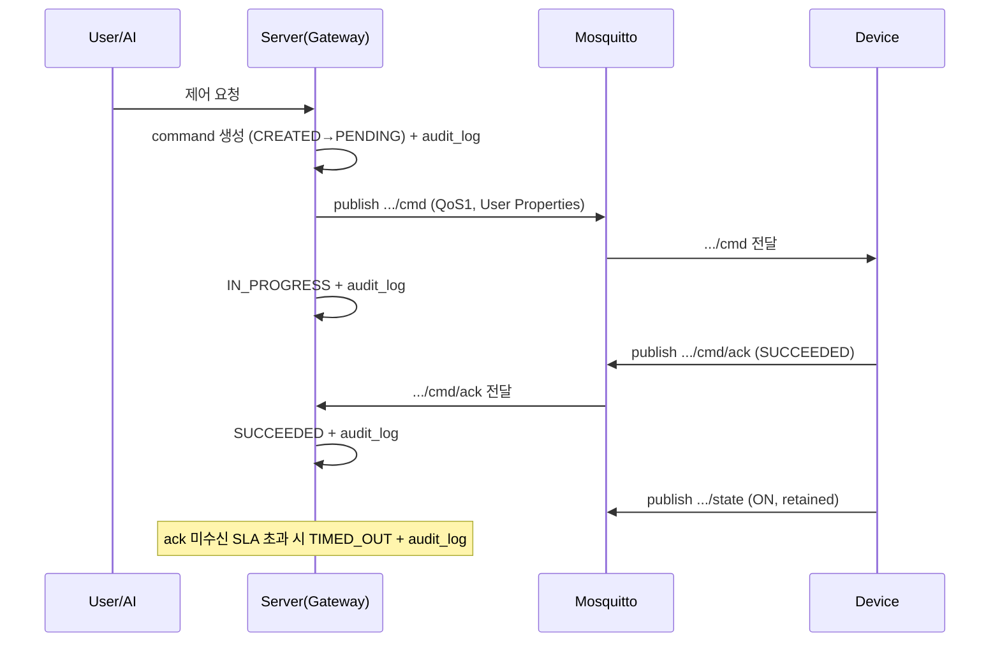

# MQTT Topic 설계서 — SmartHome IoT 관제 시스템

- 브로커: **Mosquitto**, 프로토콜 **MQTT 5**, 클라이언트 `mqtt.js`
- 근거: [PROJECT_RULES.md](../PROJECT_RULES.md) §2~§5, [iot_smarthome_srs.md](../iot_smarthome_srs.md) 3.1·4.1·4.3, [erd.md](erd.md)
- 상태: 초안 v0.1 (2026-07-09)

이 문서는 규칙(PROJECT_RULES)을 **구체 토픽/페이로드로 확정**한 것이다.
규칙과 충돌하면 PROJECT_RULES가 우선한다.

---

## 1. UNS 계층 & 토픽 문법

### 1.1 기본 구조
```
enterprise/{site}/{building}/{floor}/{area}/{device}/{suffix}
```
- 모든 세그먼트는 **소문자 kebab-case**. 공백·`/`·`+`·`#` 금지.
- 토픽 문자열은 코드에 하드코딩하지 않고 **`buildTopic()`**(packages/contracts)로만 생성.
- `{device}`는 `device.code`(ERD B), 상위 세그먼트는 각 slug(`site.slug` … `area.slug`).

### 1.2 예시
```
enterprise/site1/bldg-a/2f/living-room/light-01/state
enterprise/site1/bldg-a/2f/living-room/light-01/cmd
enterprise/site1/bldg-a/2f/living-room/thermostat-01/telemetry
enterprise/site1/bldg-a/1f/garage/gas-valve-01/alarm
```

### 1.3 `buildTopic()` 계약(개념)
```ts
buildTopic({ site, building, floor, area, device, suffix })
// → "enterprise/site1/bldg-a/2f/living-room/light-01/cmd"
```
- suffix ∈ `state | telemetry | cmd | cmd/ack | alarm`.
- 세그먼트 유효성(정규식 `^[a-z0-9][a-z0-9-]*$`) 검증 후 조합. 위반 시 throw.

---

## 2. 토픽 카탈로그

| Suffix | 방향 | QoS | Retained | 발행자 | 구독자 | 용도 |
|---|---|---|---|---|---|---|
| `/state` | Device→Server | **1** | **예** | Device | Server, Dashboard | 현재 상태(최신값 유지) |
| `/telemetry` | Device→Server | **0** | 아니오 | Device | Server(수집기) | 센서 측정값 스트림 |
| `/cmd` | Server→Device | **1** | 아니오 | Server | Device | 제어 명령 |
| `/cmd/ack` | Device→Server | **1** | 아니오 | Device | Server | 명령 실행 결과 |
| `/alarm` | Device→Server | **2** | 아니오 | Device | Server, Dashboard | 크리티컬 알람 |

> Retained는 `/state`만(§PROJECT_RULES 3.3). `cmd`/`telemetry`/`alarm`에 retained 금지 —
> 오래된 명령 재실행·유령 알람 방지.

### 2.1 그룹/배치 제어는 MQTT 토픽이 아님
Device Group은 논리 그룹(ERD B)이라 별도 토픽이 없다. 그룹/배치 명령은 **서버가 멤버
device의 `/cmd` 토픽으로 팬아웃**한다. 각 팬아웃 명령은 개별 `commandId`를 갖고 독립적으로
수명주기·감사된다(§4).

### 2.2 PTZ 카메라 (옵션 기능)
카메라는 `category=CAMERA` device(ERD B-cam)로, **일반 기기와 동일한 토픽 규약**을 쓴다.
- **PTZ 제어 = `/cmd`** 재사용(QoS1): `command` ∈ `ptz_move | ptz_goto_preset | ptz_stop`.
  ```json
  { "sessionId":"A1001", "commandId":"CMD-20260709-050",
    "command":"ptz_goto_preset", "target":"cam-01",
    "timestamp":1752045600000, "args":{ "presetId":"p-front" } }
  ```
  `ptz_move`의 `args`는 `{ "pan":±v, "tilt":±v, "zoom":±v }`. 결과는 `/cmd/ack`, 감사는 §4와 동일.
- **온라인/상태 = `/state`**, 이벤트성 알람은 `/alarm` 그대로.
- **영상 스트림은 MQTT로 전송하지 않는다.** RTSP/WebRTC/HLS는 별도 미디어 서비스가 처리하며
  대시보드는 API로 서명된 스트림 URL을 받는다(§api-spec 4.x, §architecture). 브로커 대역폭과 격리.

### 2.3 펌웨어 OTA (§device-lifecycle-ota)
- OTA 지시 = `/cmd`(QoS1) `command=ota_update`. **아티팩트는 MQTT가 아닌 HTTPS로 다운로드**(URL만 전달):
  ```json
  { "sessionId":"S1", "commandId":"CMD-...-OTA1", "command":"ota_update", "target":"light-01",
    "timestamp":1752045600000, "args":{ "version":"1.3.0", "url":"https://.../fw.bin", "sha256":"...", "sig":"..." } }
  ```
- 진행 보고 = `/telemetry` 또는 `/state`의 `ota_status`:
  `PENDING→DOWNLOADING→VERIFYING→APPLYING→SUCCESS|FAILED|ROLLED_BACK`.
- 완료 시 기기는 `/state`에 `firmwareVersion`을 실어 최신 버전을 보고 → 서버가 `device.firmware_version` 갱신.
- 서명/체크섬 검증 실패 펌웨어는 적용 거부. 각 전이는 `ota_target`+`audit_log`.

---

## 3. 페이로드 규격

### 3.1 제어 명령 `/cmd` (JSON body, SRS 3.1.3)
```json
{
  "sessionId": "A1001",
  "commandId": "CMD-20260709-001",
  "command": "turn_on",
  "target": "light-01",
  "timestamp": 1752045600000,
  "args": { }
}
```
- 필수: `sessionId, commandId, command, target, timestamp`(epoch ms). `args`는 명령별 선택.
- `commandId`는 전역 유일 + **멱등성 키**. 동일 commandId 재수신 시 device는 재실행 금지.

### 3.2 명령 메타데이터 = **MQTT 5 User Properties** (payload 아님, SRS 4.3.3)
| User Property | 예시 | 설명 |
|---|---|---|
| `Actor_ID` | `u-102` / `ai` / `system` | 행위자 |
| `Session_ID` | `A1001` | 세션 |
| `Command_ID` | `CMD-20260709-001` | payload와 일치 |
| `Role` | `ADMIN` | 발행 역할 |
| `Request_Time` | `1752045600000` | 요청 시각 |

> actor/role 등 감사 메타데이터를 payload에 **중복 기재 금지**. 감사는 User Properties 기준.

### 3.3 명령 결과 `/cmd/ack`
```json
{
  "commandId": "CMD-20260709-001",
  "status": "SUCCEEDED",
  "reasonCode": 0,
  "ts": 1752045600250,
  "deviceId": "light-01"
}
```
- `status` ∈ `IN_PROGRESS | SUCCEEDED | FAILED`. 실패 시 `reasonCode`(MQTT Reason Code) 필수.
- 서버는 ack 수신 시 `command`/`audit_log` 상태를 전이(§4).

### 3.4 상태 `/state` (Retained)
```json
{ "status": "ON", "ts": 1752045600000 }
```
- `status` ∈ `ON | OFF | WARNING | ALARM | OFFLINE` (ERD DeviceStatus, Floor Map 색상 매핑).
- 최신 상태를 retained로 유지 → 신규 구독자(대시보드)가 즉시 현재값 수신.

### 3.5 텔레메트리 `/telemetry`
```json
{ "ts": 1752045600000, "metrics": { "temperature": 22.5, "humidity": 41 } }
```
- 다중 지표를 한 메시지에 담는다. 서버 수집기가 지표별로 분해해 TimescaleDB `telemetry`에 적재(ERD H).
- QoS 0(유실 허용, 고빈도). 반영 지연 ≤ 1s(SRS 6).

### 3.6 알람 `/alarm`
```json
{
  "tier": "REACTIVE",
  "severity": "CRITICAL",
  "message": "gas leak detected",
  "ts": 1752045600000,
  "deviceId": "gas-valve-01"
}
```
- QoS 2(정확히 1회). 서버가 `alarm_log`에 적재 후 라우팅/에스컬레이션(ERD E). 전파 ≤ 3s(SRS 6).

### 3.7 LWT (`/state`, SRS 4.1.2)
```json
{ "status": "OFFLINE", "ts": 1752045600000 }
```
- 모든 device는 `connect` 시 LWT를 **필수** 등록: topic=`.../{device}/state`, retained=true.
- 비정상 종료 시 브로커가 이 메시지를 게시 → 서버가 OFFLINE 감지 및 `alarm_log` 기록.

---

## 4. 명령 수명주기와 토픽 흐름 (SRS 4.3.4)



- **모든 상태 전이는 `audit_log`에 1행씩 기록**(§PROJECT_RULES 4.3). 상태 건너뛰기 금지.
- 명령 처리 지연 평균 ≤ 300ms(SRS 6).

---

## 5. QoS / Retained 정책 요약 (SRS 4.1.1)

| 데이터 유형 | 토픽 | QoS | Retained |
|---|---|---|---|
| Telemetry | `/telemetry` | 0 | 아니오 |
| Control | `/cmd`, `/cmd/ack` | 1 | 아니오 |
| Critical Alarm | `/alarm` | 2 | 아니오 |
| Current State | `/state` | 1 | 예 |

---

## 6. 보안 & ACL (SRS 4.2, §PROJECT_RULES 5)

### 6.1 전송
- 전 구간 **TLS(mqtts/wss)**. 평문 포트(1883) 비활성화, TLS 포트(8883) 및 WSS만 개방.

### 6.2 인증
- **사용자/대시보드**: JWT(로그인 시 발급). MQTT CONNECT 시 JWT를 username 또는 `AUTH`로 전달.
- **기기**: MQTT username/password(기기별 자격 증명).
- **서비스 간**: mTLS 또는 API Key.

### 6.3 ACL (JWT claim `topics` 기준 동적 적용)
| 주체 | Subscribe | Publish |
|---|---|---|
| ADMIN | `enterprise/#` | `enterprise/#` |
| USER (areaA) | `enterprise/site1/**/areaA/#` | `.../areaA/+/cmd`(허가 device 한정) |
| MONITOR | 허가 Area 서브트리(읽기) | 없음(또는 ack/note 서버 경유) |
| Device (light-01) | 자신의 `.../light-01/cmd` | 자신의 `.../light-01/{state,telemetry,cmd/ack,alarm}` |

- ACL은 Mosquitto 정적 정책 파일이 아니라, 인증 시 발급된 **JWT claim(`topics`)**을
  브로커 인증 플러그인(예: mosquitto-go-auth / HTTP backend)이 적용한다.
- 기기는 **자신의 device 서브트리 밖으로 발행/구독 불가**.

---

## 7. 클라이언트 연결 규약

### 7.1 clientId
```
dev:{device.code}            # 기기         예) dev:light-01
svc:{service}-{instance}     # 서버 서비스  예) svc:gateway-1
web:{user.id}-{rand}         # 대시보드     예) web:u102-a1b2
```
- clientId는 전역 유일. 기기는 `clean start=false` + session expiry로 재연결 시 구독 복원.

### 7.2 연결 옵션(기기)
- `will`(LWT): §3.7
- `keepalive`: 30~60s (offline 감지 vs 트래픽 균형)
- `properties.sessionExpiryInterval`: 재접속 허용 구간

---

## 8. 대시보드 구독 패턴

- 실시간 관제(SRS 5.1): 허가 Area 서브트리를 와일드카드로 구독
  `enterprise/site1/bldg-a/+/{area}/+/state` (+ `/alarm`).
- `/state`는 retained라 구독 즉시 현재 상태 스냅샷 수신 → 초기 렌더 지연 최소화.
- 고빈도 `/telemetry`는 대시보드가 직접 구독하지 않고, 서버가 집계/다운샘플해 WebSocket으로
  전달(부하·성능 SRS 6 고려).

---

## 9. 미해결/후속 (부록 A.2 연계)

- 브로커 인증 플러그인 확정(mosquitto-go-auth HTTP backend vs 대안) 및 JWT 검증 경로
- `/telemetry` 지표별 서브토픽(`/telemetry/{metric}`) 확장 필요 여부
- 기기 프로비저닝(자격 증명 발급/회수) 절차
- Mosquitto 단일 노드 한계 시 브리징/교체(부록 A.2, SRS 6 가용성)
