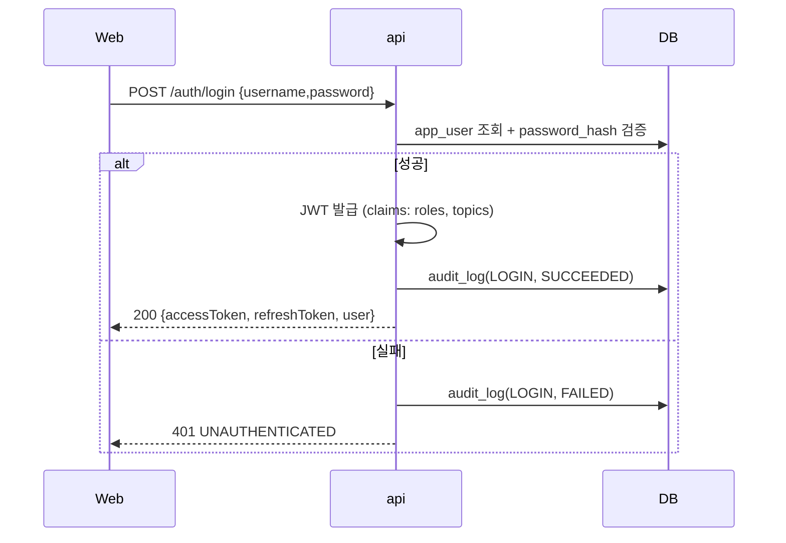
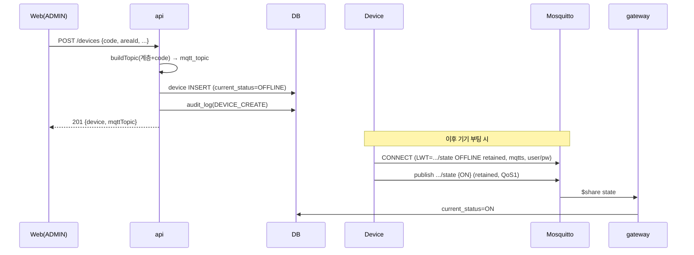
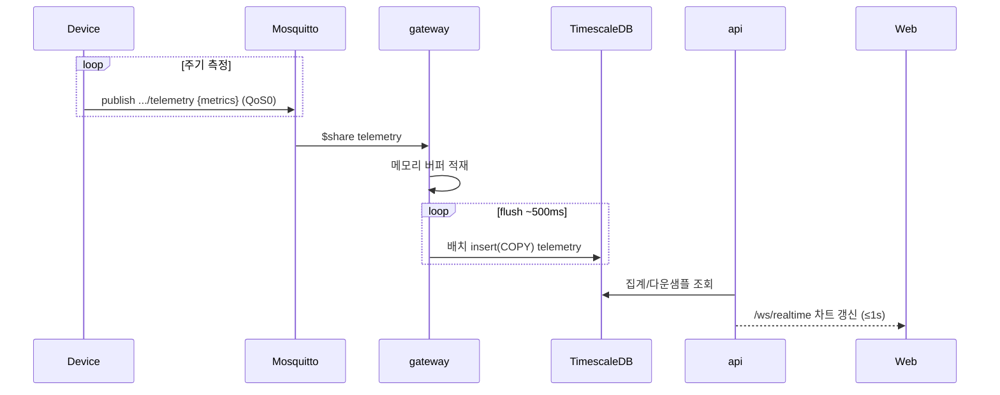
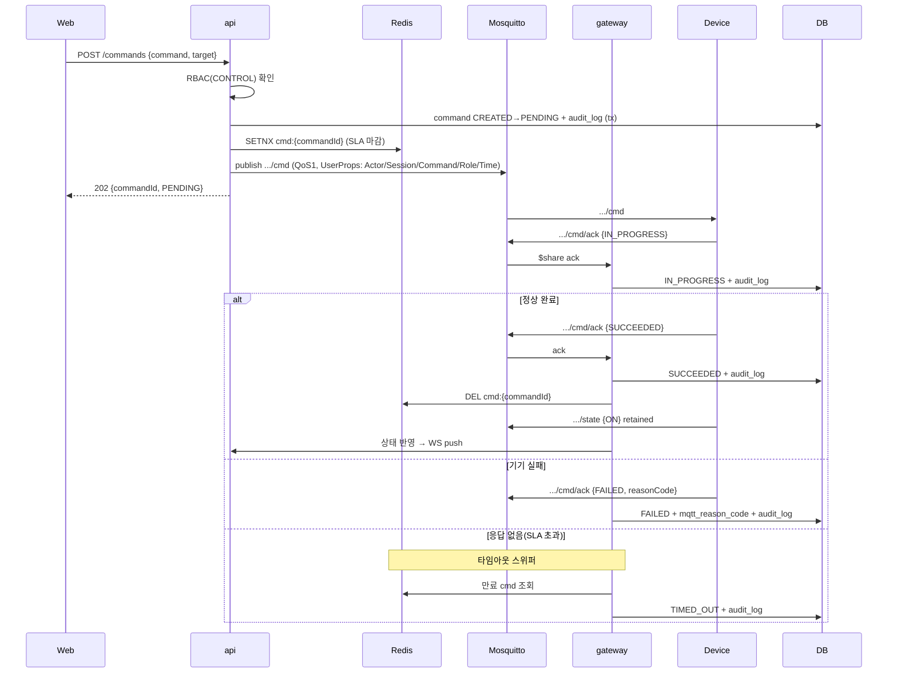
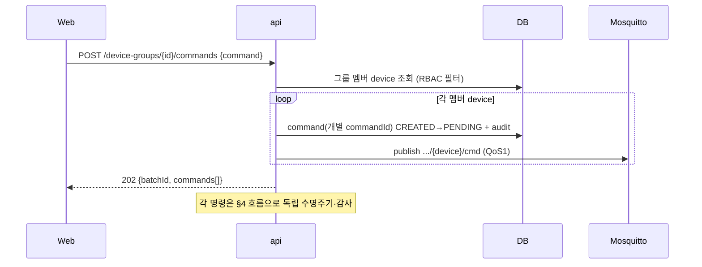
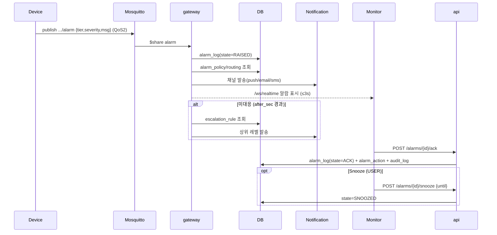
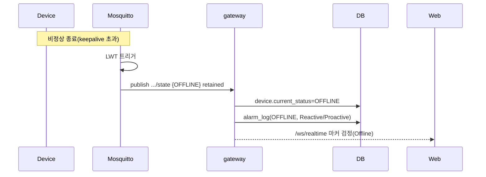
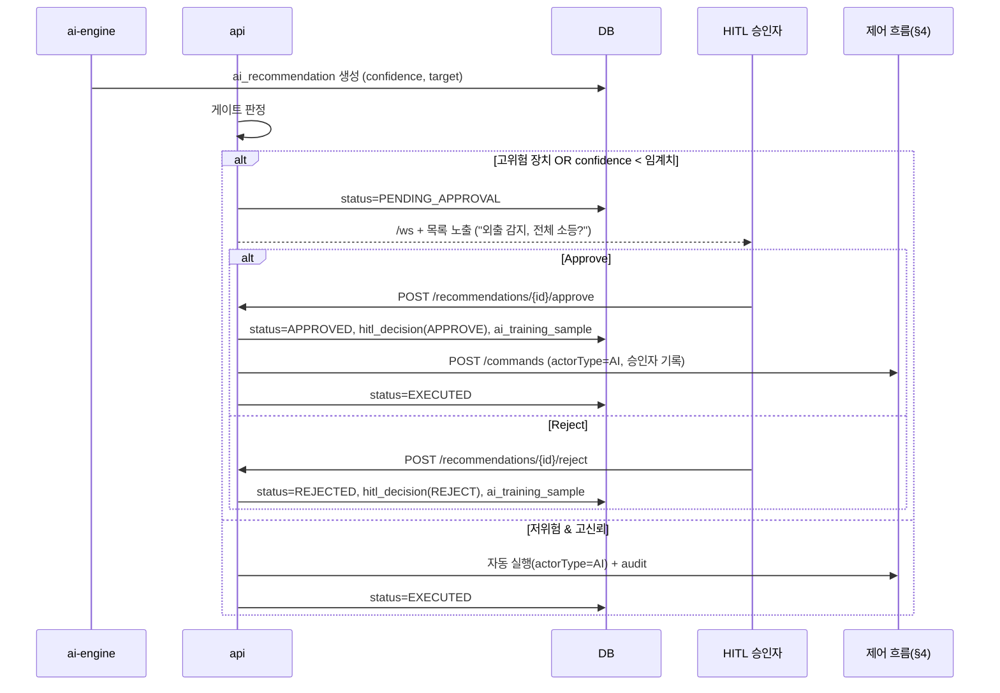
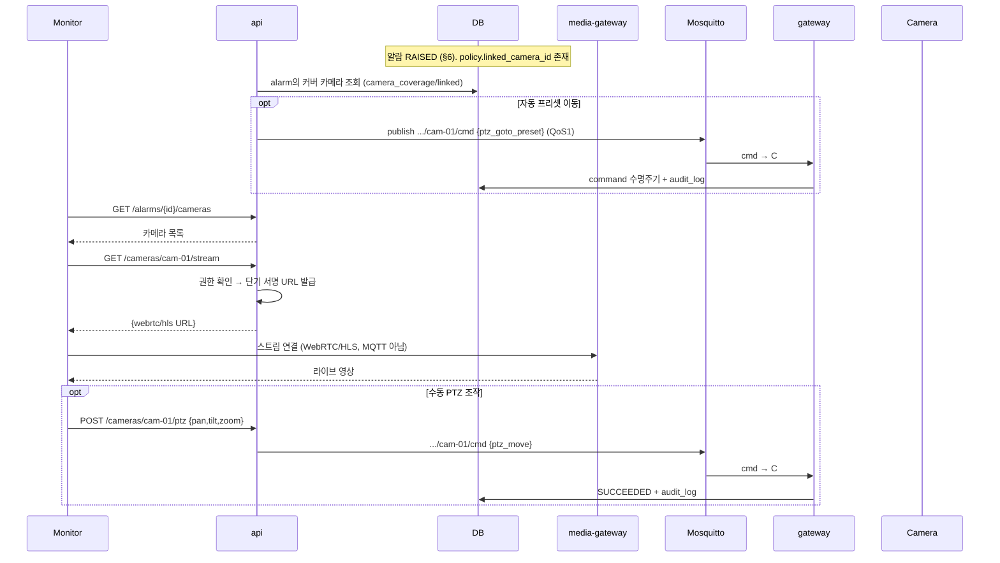
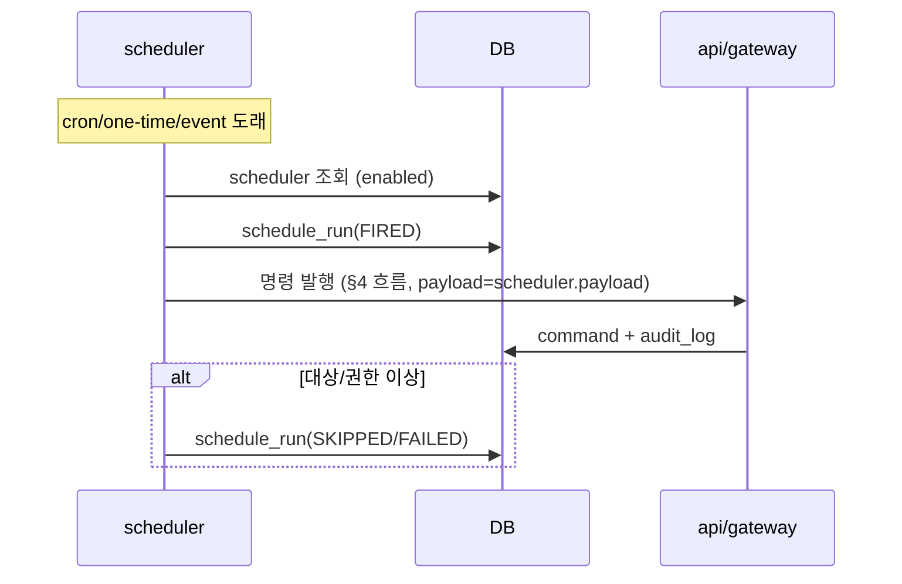

# 시퀀스 다이어그램 — SmartHome IoT 관제 시스템

- 근거: [PROJECT_RULES.md](../PROJECT_RULES.md), [erd.md](erd.md), [mqtt-topic-design.md](mqtt-topic-design.md), [api-spec.md](api-spec.md), [architecture.md](architecture.md)
- 상태: 초안 v0.1 (2026-07-09)

공통 참여자: `Web`(대시보드), `api`, `Redis`, `Mosquitto`, `gateway`, `Device`, `DB`(PostgreSQL/TimescaleDB), `ai-engine`.
모든 제어/승인/권한변경은 **`audit_log`에 기록**된다(SRS 4.2.4). 명령 상태 전이는 audit와 **동일 트랜잭션**.

---

## 1. 로그인 / 인증 (JWT)

- `topics` claim = 사용자 Area 서브트리 → 이후 MQTT ACL·WS 구독 범위(§mqtt 6.3).

---

## 2. 기기 등록 / 온보딩

---

## 3. 텔레메트리 수집 → 대시보드 반영

---

## 4. 단일 제어 명령 — 전체 수명주기 (성공/실패/타임아웃)

---

## 5. 그룹 / 배치 제어 (팬아웃)

---

## 6. 알람 발생 → 라우팅 → 에스컬레이션 → 확인

---

## 7. LWT / Offline 감지

---

## 8. AI 추천 → HITL 승인/거절

- 승인/거절은 **모두 학습 데이터**로 저장(SRS 3.5). 고위험 장치는 신뢰도와 무관하게 승인 필수.

---

## 8-cam. 알람 현장 확인 + PTZ 제어 (옵션 카메라)

- PTZ 제어는 §4 명령 수명주기·감사를 그대로 따른다. **영상은 미디어 경로**로 분리.

## 9. 스케줄러 트리거 → 명령

---

## 10. 커버리지 노트

| 흐름 | 다이어그램 |
|---|---|
| 인증 | §1 |
| 기기 온보딩 | §2 |
| 텔레메트리 | §3 |
| 제어(성공/실패/타임아웃) | §4 |
| 배치 제어 | §5 |
| 알람/에스컬레이션 | §6 |
| Offline/LWT | §7 |
| AI/HITL | §8 |
| 알람 현장확인·PTZ(옵션) | §8-cam |
| 스케줄러 | §9 |

미해결/후속(부록 A.2): 외부 연동(BMS/EMS/Voice/Vision), 멀티테넌트 인증 플로우, 알림 채널 provider별 시퀀스.
